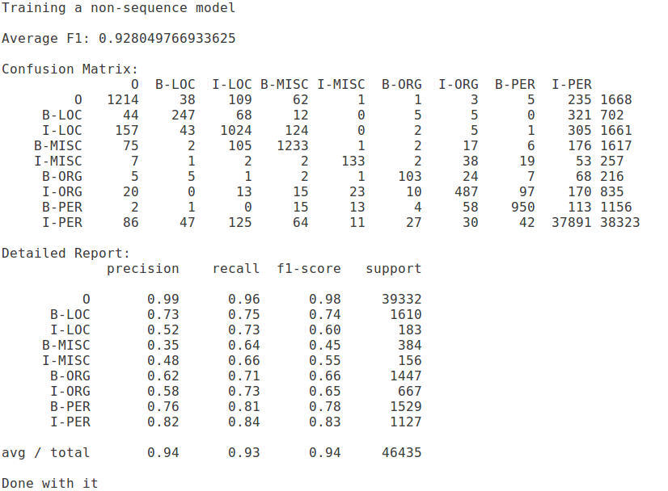
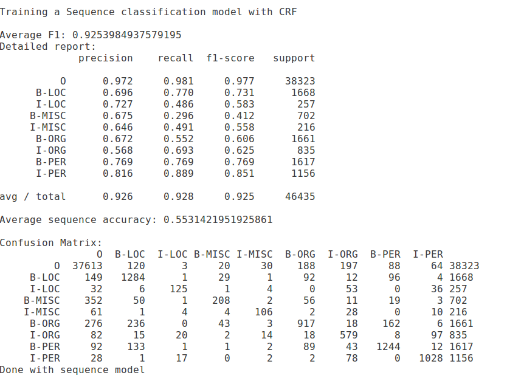

[In the last post](https://nishkalavallabhi.github.io/NER1/), I wrote about the general idea of Named Entity Recognition, the issues I noticed in the way researchers discuss the problem in contemporary research articles. My point for this post is to show - we don't need complex models to report state-of-the-art accuracies on standard datasets. I took a freely available dataset (CONLL-03) and trained three NER models:

- a Neural model, from [Anago](https://github.com/Hironsan/anago), which uses a Bi-directional LSTMs coupled with a CRF, and do not rely on anything other than annotated training data and, if needed, pre-trained word embeddings. 
- a sequence labeling model (i.e., current prediction depends on previous predictions too) using [CRF-Suite in Python](https://github.com/scrapinghub/python-crfsuite) implementation. Much has been written in the non-neural era about feature engineering for NER. Even standard textbooks list some common features. I just used word and part-of-speech contexts as features.
- a general classification model, which looks at each word, and classifies it into one of the named entity categories, without bothering about previous labels. I used the same features as CRF, and used a random forest classifier.

I tried with a couple of others as well, changing datasets, mixing models, adding more features etc. But, you get the overall picture!. 

While I tried the models in the above mentioned order, it really should have been the reverse. So, let me discuss in reverse. 
[Note: I am just dumping down my thoughts. This is not intended to be a pedagogical post/tutorial/lecture notes. However, I will be sharing whatever code I wrote for this post.]

**NER as word classification**
Conventional wisdom tells you - do not do this! Contemporary wisdom tells you - do not go beyond neural nets. I rejected both the wise warnings, and did it nevertheless, for the following reasons:
- I saw several state of the art research articles talking about 90-92% F-scores on this CONLL-03 dataset (which can be found in Anago link above). That made me wonder - what is it like without a neural model?
- That took me to CRFs, which gave me an F-score of 92.54% with very unimaginative features [You put some effort into thinking about simple features, and you can reach 95+ on that dataset, believe me. I did]. 
- That left me wondering - really? what is it like if I don't use even CRFs, and just treat NER as word level classification problem?

Here is what I got, using a BIO notation for the dataset (btw, BIO/IO/BILOU - very little difference. It doesn't matter in terms of real differences). 
Average F-score: 92.8% (cool stuff, you see. Best result, perhaps?)
{:class="img-responsive"}

**NER as a sequence labeling problem**:
Conditional Random Fields (CRFs) used to be very popular for NER, a couple of years back. I just followed that approach, with the same feature set as above. Here are are the resutls:
Average F-score: 92.5% (it appears slightly better, but really, there is no difference in terms of that number. You can notice category wise differences if you look beyond a single number).
{:class="img-responsive"}

**NER as a neural network based sequence labeling problem**:
As mentioned above, I used anago as is.

  
from anago.utils import load_data_and_labels  
import anago    
x_train, y_train = load_data_and_labels('data/conll2003/en/ner/train.txt')  
x_test, y_test = load_data_and_labels('data/conll2003/en/ner/test.txt')  
x_dev, y_dev = load_data_and_labels('data/conll2003/en/ner/valid.txt')  
model = anago.Sequence()  
model.fit(x_train, y_train, x_dev, y_dev, epochs=15)  
model.score(x_test,y_test)  

This NER model, with tuning, gave me a F score of 78.75 on the test set. The paper that describes this approach, after doing several experiments, reports a best score of 90.7. Please note - I did not do any hyper parameter tuning for the first two approaches. I just wanted to post something quick on this. Since these results seem too high for such a simple approach, I am kind of surprised. I then also spent sometime just using these models on random documents such as blog posts (joblib is very useful!), and qualitatively analysing the NER tags. It seemed pretty reasonable! My code is [here](https://github.com/nishkalavallabhi/NERObservations). I tried to add some comments, but it is not exhaustive.

Morals of the story for now are: 
- While research papers give you a lot of ideas, they should not stop you from looking for simpler explanations, if you think there are simpler explanations.  
- It may look very uncool and old-fashioned to not look into more complex neural networks, but it is also important to realize they are not a universal cure.  
- A single number result won't tell much (I did not put the majority baseline result - i.e., where everything is classified as Other, but you can deduce from here).  
- You are free to expand on this, get to 99% accuracy or whatever on the same dataset, but keep in mind, all that may not make sense if you have to use NER in a production system, in a specialized domain. You will need to do more work.

