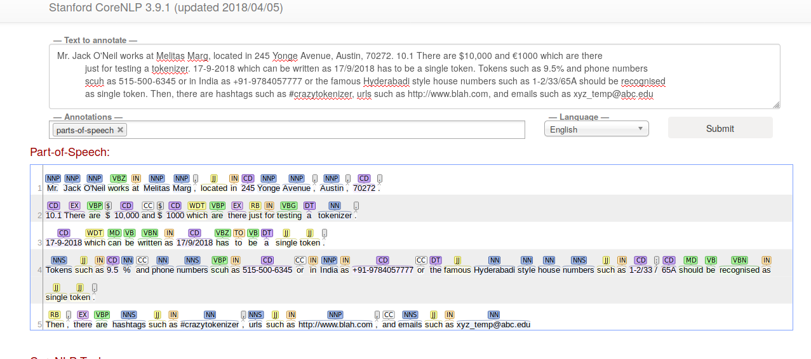

I was planning on writing more on Key phrase extraction and document tagging in NLP, but got occupied with work. In the meanwhile, I had a few discussions with people on one of the basic pre-processing tasks in NLP - tokenization (i.e., the task of breaking of a piece of text into individual tokens where a token can refer to a word, punctuation mark etc.). This is essential to do anything else further down in the NLP pipeline for any application (e.g., information extraction, sentiment analysis, machine translation, chatbots etc).

What is the big deal about this seemingly simple task? When I taught Statistical NLP @Iowa State University, I always had this discussion in the first or second week of classes. But in the context of tokenizing text as a part of some implementation that goes live into a software product used by some people around the world, these discussions took a new turn. We realized what seems intuitive and "has to be considered a token" is not really considered so with existing tokenizers. 

Let us consider the task of a tokenizer: If I take a sentence: "Here is a short sentence.", we can split into tokens as: [Here, is, a, short, sentence, .]. Simple enough, isn't it? Splitting a string by whitespace, and keeping the final period/question mark/explanation mark as a token by itself. So, what happens with: "Here is a short tweet: \#nlp tweets can be emailed to nlp_anything@gmail.com" - we would assume \#nlp and nlp_anything@gmail.com will be identified as a single token, right?. Or take this sentence: "My phone number is: 515-000-123". We would think the number is caught as one string. In "Today's date is 22-9-2018 (or 9-22-2018, depending on where you are), I would think 22-9-2018 is one entity (although, I don't think I expect 20th June 2018 in "That day was 20th June 2018" is to be identified as one "token" - in NLP jargon, that is a "chunk/phrase/etc"). Turns out,  tokenization is more complex than it sounds, and even with real world implementations being far from perfect.

I am going to look at 3 popular language processing libraries that are used by both academia and industry folks around the world, to compare how their tokenizers work.
- NLTK (nltk.org - Python)
- Spacy (spacy.io - Python)
- Stanford CoreNLP (corenlp.run - Java)  
Disclaimer: This is by no means an exhaustive test of tokenization! You can think I am just amused, and I want to further amuse myself! For a more academic discussion, take a look at Manning & Jurafsky's textbook's chapter on regular expressions, where there is a section on text normalization, which discusses these issues (and much more!). I am only looking at an English example too. 


Here is the same sentence I will use.
> Mr. Jack O'Neil works at Melitas Marg, located in 245 Yonge Avenue, Austin, 70272. 10.1 There are $10,000 and €1000 which are there
> just for testing a tokenizer. 17-9-2018 which can be written as 17/9/2018 has to be a single token. Tokens such as 9.5% and phone numbers
> such as 515-500-6345 or in India as +91-9784057777 or the famous Hyderabadi style house numbers such as 1-2/33/65A should be recognised
> as single token. Then, there are hashtags such as #crazytokenizer, urls such as http://www.blah.com, and emails such as xyz_temp@abc.edu. 

- okay, obviously, I made this up. My goal is to see: [Mr., O'Neil, 10.1, $10,000, €1000, 17-9-2018, 17/9/2018, 9.5%, 515-500-6345, +91-9784057777, 1-2/33/65A, #crazytokenizer, http://www.blah.com, xyz_temp@abc.edu] as single tokens (14 of them), that are not split up further (rest of the tokens are not weird. They will be properly identified!). Let us see how the tokenizers from NLTK, Spacy and Stanford CoreNLP do with this.

Let me start with Stanford's tokenizer, because it has a online demo:
- Mr., O'Neil, 10.1, 17-9-2018, 17/9/2018, 515-500-6345, +91-9784057777, #crazytokenizer, http://www.blah.com, xyz_temp@abc.edu - these are identified as single tokens (10/14)  
- **$ and 10,000 are identified as separate tokens, € became a $ and is separated from 1000, 9.5 and % are separated, 1-2/33/65A got separated as: [1-2/33, /, 65A]** (4/14)

Here is a screenshot of the output from corenlp.run (I am also showing part of speech tags, because I got curious about the dollar and euro thing.
{:class="img-responsive"}

Let us move to NLTK - NLTK has a bunch of [tokenization options](https://www.nltk.org/api/nltk.tokenize.html). Let me use word_tokenizer and TweetTokenizer from these.
```{python}
from nltk.tokenize import word_tokenize, TweetTokenizer
content = """Mr. Jack O'Neil works at Melitas Marg, located in 245 Yonge Avenue, 
	   Austin, 70272. 10.1 There are $10,000 and €1000 which are there
           just for testing a tokenizer. 17-9-2018 which can be written as 
           17/9/2018 has to be a single token. Tokens such as 9.5% and 
           phone numbers such as 515-500-6345 or in India as +91-9784057777 
           or the famous Hyderabadi style house numbers such as 1-2/33/65A 
           should be recognised as single token. Then, there are hashtags 
           such as #crazytokenizer, urls such as http://www.blah.com, and 
           emails such as xyz_temp@abc.edu"""
tweeter = TweetTokenizer()
print(word_tokenize(content))
print(tweeter.tokenize(content))
```

word_tokenize identifies:  
- Mr., O'Neil, 10.1, €1000, 17-9-2018, 17/9/2018, 515-500-6345, +91-9784057777, 1-2/33/65A are identified as single tokens (9/14)  
- **$ and 10,000 are identified as separate tokens, 9.5 and % are separated, \# and crazy_tokenizer are separated, the url got split into: [http, :, //www.blah.com], and the email as: [xyz_temp, @, abc.edu]** (5/14)

(I found it strange that €1000 is a single token, but $10,000 is two tokens).  

TweetTokenizer identifies:  
- O'Neil, 10.1, 515-500-6345, +91-9784057777, #crazytokenizer, http://www.blah.com, xyz_temp@abc.edu are identified correctly (7/14)
- Mr and . are separated; $ and 10,000 are separated; € and 1000 are separated; 17-9- and 2018 are separated; 17/9/2018 became 3 tokens - 17/9, /, 2018; 9.5 and % got separated; 1-2/33/65A became 4 tokens: 1-2, /, 33/65, A - so 7/14 were wrongly identified. This is a tokenizer written specifically for tweets, but Stanford tokenizer seems to be catching all these, and more. 

Now, let me move to Spacy. While spacy perhaps does not have many tokenizers as NLTK, it does have multiple "models" for English (Spacy's tokenization is also "learnt" along with others such as part of speech tags, named entities, parse structures etc). I wasn't sure if these models change the tokenization. They perhaps improve on other tasks down the pipeline such as named entity recognition. But, I anyway just ran the same text through spacy tokenizer. It turns out all the three models give the same output for my text.   

```{python}
import spacy
from spacy.tokens import Doc

def spacy_tokenizer(text,path):
    tokens = []
    nlp = spacy.load(path)
    doc = nlp(text)
    for token in doc:
        tokens.append(token.text)
    return tokens

modelpaths = ["en_core_web_sm", "en_core_web_md", "en_core_web_lg"]
for model in modelpaths:
   print(spacy_tokenizer(content,model))

```

Spacy's tokenization identifies:  
- Mr., O'Neil, 10.1, 17/9/2018, http://www.blah.com, xyz_temp@abc.edu (6/14 were correctly tokenized)  
- **$ and 10,000 are separated; € and 1000 are separated; 17-9-2018 became as many as 5 tokens! [17, -, 9, -, 2018]; 9.5 and % got separated; 515-500-6345 became four tokens [515,-,500,-,6345], which did not surprise me now that I saw the date example; +91-9784057777 also similarly became 4 tokens; 1-2/33/65A became 3 tokens [1, -, 2/33/65A]; hashtag got separated into two.** (8/14 were wrongly tokenized)

**What surprised me here is that it identified newline followed by tab also as another token, while others did not.**

Finally, after doing all this, I felt like I should write my own tokenizer for fun. So, I quickly mashed up a small tokenizer which won't account for everything I mentioned above, but I was curious to see how far I can get with it:  
```{python}
def new_tokenizer(somestr):
    split_at = ".,!?\"\' ;:()[]{}" 
    specials = ".,\'"
    #dont_split_at = ""
    result = ""
    for i in range(0,len(somestr)):
        if somestr[i] in split_at:
                #split at single quote or comma or period only 
		#if it is followed by a split_at char or space.
                if i < len(somestr)-1 and somestr[i] in specials 
			and somestr[i+1] not in split_at:
                    result += somestr[i]
                else:
                    result += " " + somestr[i] + " "
        else:
            result += somestr[i]
    return re.sub(" +"," ", result.strip().replace("\n","")).split(" ")

print(new_tokenizer(content))
```

This identifies:  
- O'Neil, 10.1, $10,000, €1000, 17-9-2018, 17/9/2018, 9.5%, 515-500-6345, +91-9784057777, 1-2/33/65A, #crazytokenizer, xyz_temp@abc.edu are identified correctly (12/14!)
- Mr. got split into two (!) (Mr, .), and the url got split into 3 tokens (http, :, //www.blah.com) (2/14)

I wrote this tokenizer after looking at the example (but before adding the last sentence to check for urls). Considering that it is hilariously simple (it can be definitely made faster with regular expressions, I guess, for longer texts. This is just an illustration), we see that it is not terribly difficult to get better at these things with simple string matching (these two cases I missed can easily be included.). I did not do any exhaustive testing, but, overall, whoa, this is already a lot of variation between standard tokenizers! 

Few things that surprised me:   
- $ and 10,000 are separated most of the time, but it was not consistent with the Euro symbol. This separation perhaps has something to do with the annotated datasets for POS-tagging and other tasks that have tokenization as its first step, which mostly consider $ as a symbol/tag as its own. Strange thing for me is: Stanford tagger converted even Euro to Dollar (! think about this happening in some commercial application that uses Stanford tagger!).  
- Some formats of dates seem to be consistently okay, but others are not (I wanted to say same is true with phone numbers, but, no, Spacy disappointed me there!).  
- % symbol is also consistenly separated. 

One can argue whether all these requirements I have are proper requirements in the first place. But, that is the thing - neither these requirements, nor the different tokenizers are consistent among different people/software.  

Two lessons I learnt:
- Regular expressions are still very useful for this task, even in the world dominated by deep learning. I found some regular expressions in the tokenizer code for nltk and stanford, but did not find any in Spacy's (I did not look exhaustively, but all of these are on github, so any reader of this post can take a look and message me if I am wrong on this!). 
- Tokenization is something to think seriously about before starting on any NLP project. After all, everything we do in NLP relies on some kind of tokenization as the first step! So, we need to know whether a given tokenizer meets our needs. 

With that, I guess I can end this long-ish post. To those who survived till here, thanks for reading!


Acknowledgements: [@ericlefort](https://github.com/EricLeFort), with whom I discussed some of these issues over the past few days.
 


